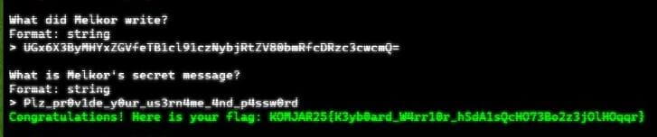
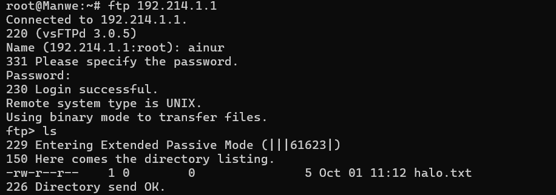

# Laporan Modul 1 Jaringan Komputer

Untuk mempersiapkan pembuatan entitas selain mereka, Eru yang berperan sebagai Router membuat dua Switch/Gateway. Dimana Switch 1 akan menuju ke dua Ainur yaitu Melkor dan Manwe. Sedangkan Switch 2 akan menuju ke dua Ainur lainnya yaitu Varda dan Ulmo. Keempat Ainur tersebut diberi perintah oleh Eru untuk menjadi Client.

intinya : 

Router (Eru) bikin 2 Switch

Switch 1 => Melkor & Manwe (as Client)

Switch 2 => Varda & Ulmo (as Client)

Karena menurut Eru pada saat itu Arda (Bumi) masih terisolasi dengan dunia luar, maka buat agar Eru dapat tersambung ke internet.

	caranya : 

Tambahkan NAT

ping google.com

Node NAT digunakan sebagai penghubung antara jaringan virtual GNS3 dan jaringan Internet. Tanpa NAT, router Eru hanya berfungsi menghubungkan client dalam jaringan lokal, tetapi tidak dapat meneruskan paket ke luar.

Sebelum menambahkan NAT : 

Sesudah ditambahkan

Sekarang pastikan agar setiap Ainur (Client) dapat terhubung satu sama lain.

Config Eru

auto eth0

iface eth0 inet dhcp

auto eth1

iface eth1 inet static

	address 192.214.1.1

	netmask 255.255.255.0

auto eth2

iface eth2 inet static

	address 192.214.2.1

	netmask 255.255.255.0

Config Melkor

auto eth0

iface eth0 inet static

	address 192.214.1.2

	netmask 255.255.255.0

	gateway 192.214.1.1

Config Manwe

auto eth0

iface eth0 inet static

	address 192.214.1.3

	netmask 255.255.255.0

	gateway 192.214.1.1

Config Varda

auto eth0

iface eth0 inet static

	address 192.214.2.2

	netmask 255.255.255.0

	gateway 192.214.2.1

Config Ulmo

auto eth0

iface eth0 inet static

	address 192.214.2.3

	netmask 255.255.255.0

	gateway 192.214.2.1

Setelah berhasil terhubung, sekarang Eru ingin agar setiap Ainur (Client) dapat mandiri. Oleh karena itu pastikan agar setiap Client dapat tersambung ke internet.

Router Eru

Ketikkan iptables -t nat -A POSTROUTING -o eth0 -j MASQUERADE -s [Prefix IP].0.0/16

Ketikkan command cat /etc/resolv.conf di Eru

Lalu ketikkan command 

echo nameserver 192.168.122.1 > /etc/resolv.conf

pada node yang lainnya 

Node Melkor

Node Manwe

Node Varda

Node Ulmo

Coba ping google.com

Ainur terkuat Melkor tetap berusaha untuk menanamkan kejahatan ke dalam Arda (Bumi). Sebelum terjadi kerusakan, Eru dan para Ainur lainnya meminta agar semua konfigurasi tidak hilang saat semua node di restart.

Eru

Node lainnya

Setelah semua Ainur terhubung ke internet, Melkor mencoba menyusup ke dalam komunikasi antara Manwe dan Eru. Jalankan file berikut () lalu lakukan packet sniffing menggunakan Wireshark pada koneksi antara Manwe dan Eru, lalu terapkan display filter untuk menampilkan semua paket yang berasal dari atau menuju ke IP Address Manwe. Simpan hasil capture tersebut sebagai bukti.

Manwe

apt update 

apt install unzip

wget --no-check-certificate "https://docs.google.com/uc?export=download&id=1bE3kF1Nclw0VyKq4bL2VtOOt53IC7lG5" -O traffic.zip && 

unzip traffic.zip -d traffic && 

mv traffic/traffic.sh . && 

rm -r 6 && rm -r traffic

chmod +x traffic.sh

./traffic.sh

Start capture Switch 1 => Eru

ip.addr == [ip manwe] || ip.addr == 192.214.1.3		

Untuk meningkatkan keamanan, Eru memutuskan untuk membuat sebuah FTP Server di node miliknya. Lakukan konfigurasi FTP Server pada node Eru. Buat dua user baru: ainur dengan hak akses write&read dan melkor tanpa hak akses sama sekali ke direktori shared. Buktikan hasil tersebut dengan membuat file teks sederhana kemudian akses file tersebut menggunakan kedua user.

ERU

adduser ainur

adduser melkor

mkdir -p /srv/ftp/shared

chown -R ainur:ainur /srv/ftp/shared

chmod 700 /srv/ftp/shared

nano /etc/vsftpd.conf

local_enable=YES

write_enable=YES

chroot_local_user=YES

allow_writeable_chroot=YES

service vsftpd restart

Atur home directory khusus user ainur:

usermod -d /srv/ftp/shared ainur

Pengujian di Node Manwe (client FTP)

Ulmo, sebagai penjaga perairan, perlu mengirimkan data ramalan cuaca ke node Eru. Lakukan koneksi sebagai client dari node Ulmo ke FTP Server Eru menggunakan user ainur. Upload sebuah file berikut (). Analisis proses ini menggunakan Wireshark dan identifikasi perintah FTP yang digunakan untuk proses upload.

wget --no-check-certificate "https://docs.google.com/uc?export=download&id=11ra_yTV_adsPIXeIPMSt0vrxCBZu0r33" -O cuaca.zip

	capture ulmo dan eru

file e di ulmo

masuk lewat ulmo tp sebagai eru (pake ip eru)

ftp ainur

ls itu gada apa”

terus put cuaca

ls 

cuaca

 ulmo

apt update

apt install inetutils-ftp

Eru ingin membagikan "Kitab Penciptaan" di (link file) kepada Manwe. Dari FTP Server Eru, download file tersebut ke node Manwe. Karena Eru merasa Kitab tersebut sangat penting maka ia mengubah akses user ainur menjadi read-only. Gunakan Wireshark untuk memonitor koneksi, identifikasi perintah FTP yang digunakan, dan uji akses user ainur.

file punya eru

DARI SINI BUKA WIRESHARK switch 1 & manwe

node manwe -> ftp eru -> login ainur -> get kitab

ubah akses ainur read only lewat eru

node manwe -> ftp eru -> login ainur -> get kitab atau delete/put

kitab punya eru (download link ke eru)

baru download dari manwe pake ftp

wget --no-check-certificate "https://docs.google.com/uc?export=download&id=11ua2KgBu3MnHEIjhBnzqqv2RMEiJsILY" -O kitab_ciptaan.zip

ini di shared folder

capture

ftp ip

ftp> get kitab_ciptaan.zip

local: kitab_ciptaan.zip remote: kitab_ciptaan.zip

229 Entering Extended Passive Mode (|||41034|)

150 Opening BINARY mode data connection for kitab_ciptaan.zip (704 bytes).

100% |*******************************|   704        4.06 MiB/s    00:00 ETA

226 Transfer complete.

704 bytes received in 00:00 (856.16 KiB/s)

chmod 400 folder shared

Melkor yang marah karena tidak diberi akses, mencoba melakukan serangan dengan mengirimkan banyak sekali request ke server Eru. Gunakan command ping dari node Melkor ke node Eru dengan jumlah paket yang tidak biasa (spam ping misalnya 100 paket). Amati hasilnya, apakah ada packet loss? Catat average round trip time untuk melihat apakah serangan tersebut mempengaruhi kinerja Eru.

wireshark melkor dan switch

pingggg

Sebelum era koneksi aman, Eru sering menyelinap masuk ke wilayah Melkor. Eru perlu masuk ke node tersebut untuk memeriksa konfigurasi, namun ia tahu Melkor mungkin sedang memantau jaringan. Buktikan kelemahan protokol Telnet dengan membuat akun dan password baru di node Melkor kemudian menangkap sesi login Eru ke node Melkor menggunakan Wireshark. Tunjukkan bagaimana username dan password dapat terlihat sebagai plain text. 

melkor buat user, download inettd -> set config (supaya telnet bisa jalan)

service inettd restart

di eru telnet ke melkor (jangan lupa wire)

Eru mencurigai Melkor menjalankan beberapa layanan terlarang di node-nya. Lakukan pemindaian port sederhana dari node Eru ke node Melkor menggunakan Netcat (nc) untuk memeriksa port 21, 80, dalam keadaan terbuka dan port rahasia 666 dalam keadaan tertutup.

download sesuatu yang membuka 21, 80 di melkor

nc 21,80,666 tujuannya ip melkor

Setelah insiden penyadapan Telnet, Eru memerintahkan semua koneksi administratif harus menggunakan SSH (Secure Shell) untuk mengamankan jaringan. Lakukan koneksi SSH dari node Varda ke Eru. Tangkap sesi tersebut menggunakan Wireshark. Analisis dan jelaskan mengapa username dan password tidak dapat dilihat seperti pada sesi Telnet. Tunjukkan paket-paket terenkripsi dalam hasil capture sebagai bukti keamanan SSH.

install openssh di eru

set config ssh , dan pw ssh

di varda connect ke eru lewat ssh (jgn lupa buka wire)

Setelah gagal mengakses FTP, Melkor melancarkan serangan brute force terhadap  Manwe. Analisis file capture yang disediakan dan identifikasi upaya brute force Melkor. 

() nc 10.15.43.32 3401

Lihat jumlah packet di bagian bawah wireshark. 

terapkan filter http dan scroll ke bawah dikarenakan ini bruteforce. Anda bisa lihat di bawah ini: 

Lihat packet di atasnya akan mengandung username dan password.

Klik paket dan follow tcp stream dan hasil akan menampilkan 41824.

Hasil dari TCP stream akan menampilkan tools yang digunakan.

Melkor menyusup ke ruang server dan memasang keyboard USB berbahaya pada node Manwe. Buka file capture dan identifikasi pesan atau ketikan (keystrokes) yang berhasil dicuri oleh Melkor untuk menemukan password rahasia.

() nc 10.15.43.32 3402

	1. What device did Melkor use?

Cara:
Gunakan filter _ws.col.info == "GET DESCRIPTOR Response STRING" lalu Anda akan menemukan paket seperti ini:

2. What did Melkor Write?

Cara:
Gunakan filter usbhid.data lalu export as csv. Upload CSV file ke ChatGPT untuk mendapatkan HID Data nya saja dalam bentuk txt. Lalu Gunakan HID Data decoder untuk decode hid_data.txt. Setelah itu, hasil decode adalah base64 yang mana akan didecode lagi dan menghasilkan pesan di atas.

Melkor semakin murka ia meletakkan file berbahaya di server milik Manwe. Dari file capture yang ada, identifikasi file apa yang diletakkan oleh Melkor.

	() nc 10.15.43.32 3403

Cara:

Terapkan filter FTP lalu Anda akan menemukan username dan password di bawah ini:

Terapkan Filter tcp contains “.exe” maka akan terlihat file exe tersembunyi

Notes Stream Index: q = 2, w = 3, e = 4, r = 5, t = 6

Terapkan filter berikut: ftp-data && tcp.stream eq N (Ganti N dengan Stream Index dari setiap huruf.exe). Lalu, akan menampilkan seperti ini: 

Klik kanan lalu follow TCP Stream, Lalu pilih show as Raw

Save as [huruf].exe di linux.

Lalu gunakan command sha256sum [huruf].exe di linux untuk mendapatkan hash.

Manwe membuat halaman web di node-nya yang menampilkan gambar cincin agung. Melkor yang melihat web tersebut merasa iri sehingga ia meletakkan file berbahaya agar web tersebut dapat dianggap menyebarkan malware oleh Eru. Analisis file capture untuk menggagalkan rencana Melkor dan menyelamatkan web Manwe.

() nc 10.15.43.32 3404

1. What is the name of the first suspicious file?

Cara:

Gunakan filter: http contains ".exe" || smb2.filename contains ".exe"

maka Anda akan menemukan paket ini:

Klik Follow TCP Stream lalu Tekan File > Export Objects > HTTP

2. What is the name of the second suspicious file?

Cara:

Input dari hasil Export Objects > HTTP

3. What is the hash of the second suspicious file (knr.exe)?

Cara:

Save file ke linux lalu gunakan command sha256sum knr.exe maka Anda akan mendapatkan sha256sum dari knr.exe seperti ini: 
749e161661290e8a2d190b1a66469744127bc25bf46e5d0c6f2e835f4b92db18

Karena rencana Melkor yang terus gagal, ia akhirnya berhenti sejenak untuk berpikir. Pada saat berpikir ia akhirnya memutuskan untuk membuat rencana jahat lainnya dengan meletakkan file berbahaya lagi tetapi dengan metode yang berbeda. Gagalkan lagi rencana Melkor dengan mengidentifikasi file capture yang disediakan agar dunia tetap aman.

() nc 10.15.43.32 3405

Cara:

File > Export Object > SMB

Bisa terlihat bahwa terdapat dua file exe dan ada nama dari file tersebut.

Hash dari nama kedua file exe	

Kedua file disave di linux dan gunakan command sha256sum <namafile> lalu akan muncul hasilnya.

Manwe mengirimkan email berisi surat cinta kepada Varda melalui koneksi yang tidak terenkripsi. Melihat hal itu Melkor sipaling jahat langsung melancarkan aksinya yaitu meneror Varda dengan email yang disamarkan. Analisis file capture jaringan dan gagalkan lagi rencana busuk Melkor.

	() nc 10.15.43.32 3406

	1. Cara: 

Terapkan display filter: smtp lalu cari konten yang berisi ancaman pada kolom info seperti di bawah ini:

Dapat dilihat nama pengirimnya Your Life dan dia mengirim pesan ancaman

Buka paket dan lihat line based text data, di situ terdapat data-data yang kita butuhkan untuk menjawab pertanyaan seperti jumlah ransom yang diminta, bitcoin walletnya

Untuk yang terakhir kalinya, rencana besar Melkor yaitu menanamkan sebuah file berbahaya kemudian menyembunyikannya agar tidak terlihat oleh Eru. Tetapi Manwe yang sudah merasakan adanya niat jahat dari Melkor, ia menyisipkan bantuan untuk mengungkapkan rencana Melkor. Analisis file capture dan identifikasi kegunaan bantuan yang diberikan oleh Manwe untuk menggagalkan rencana jahat Melkor selamanya.

() nc 10.15.43.32 3407

Cara:

Gunakan filter tls && tls.handshake.type == 2 untuk melihat paket TLS handshake bertipe “Server Hello”.

Bisa dilihat bahwa encryption method yang digunakan adalah TLS.

Pada bagian ini kita menggunakan log file yang sudah disediakan. Pertama, klik edit lalu preferences, pada bagian protocol drop down ke bagian TLS lalu (Pre)-master-log-filename kita isi dengan log file yang sudah disediakan pada link.

Klik ok dan bisa dilihat bahwa ada perubahan dalam list packets.

Setelah itu, buka file lalu klik Export Object > HTTP..

Bisa dilihat terdapat file yang paling besar sizenya yaitu invest_20.dll

Save invest_20.dll ke linux lalu gunakan command sha256sum invest_20.dll